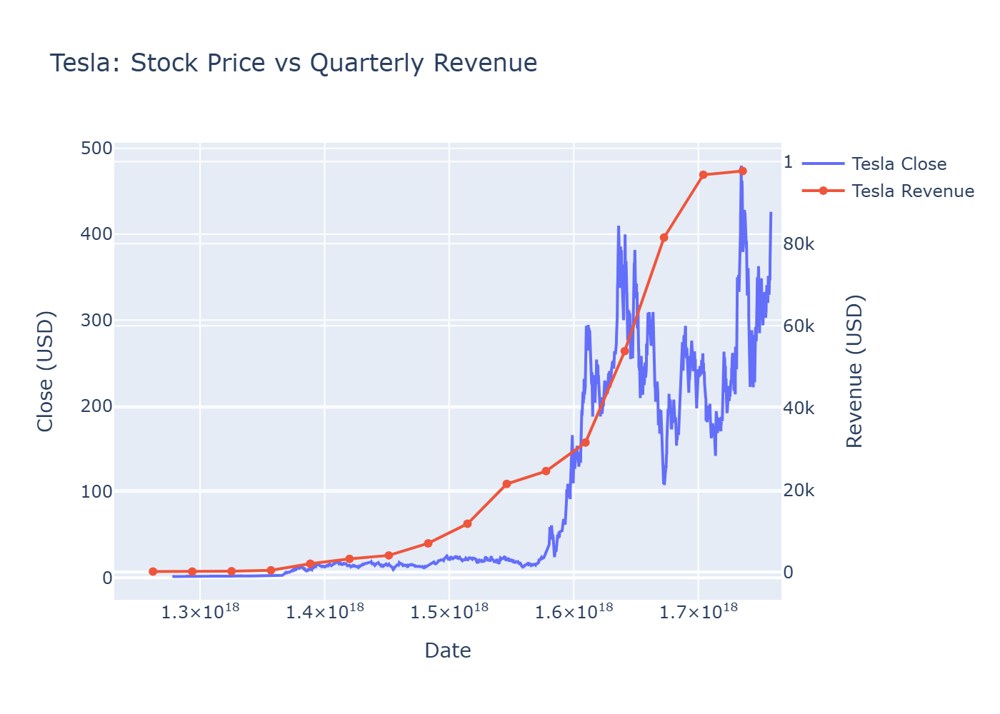
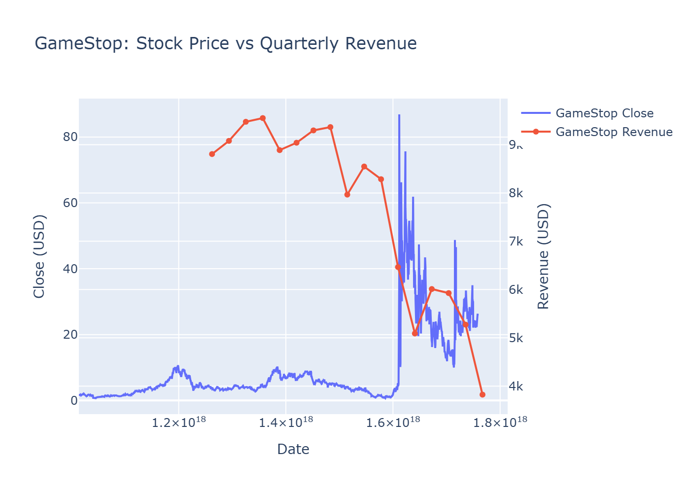
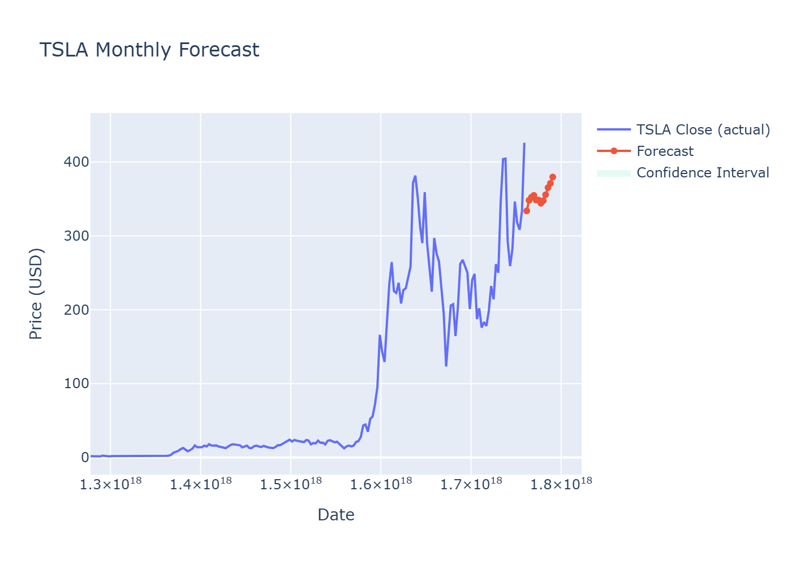
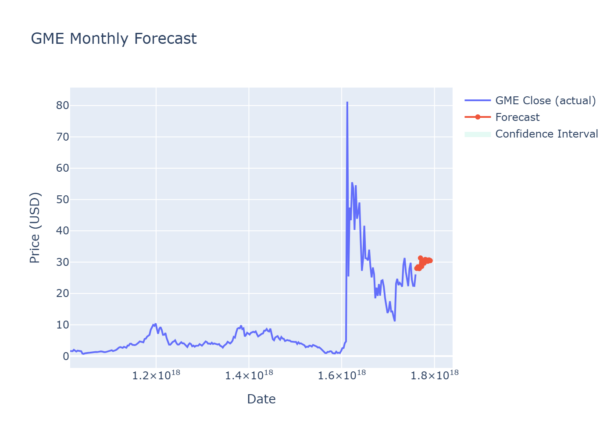

  

  <em>
    \(\theta \leftarrow \theta - \alpha \nabla J(\theta)\) &nbsp;·&nbsp;
    \(\hat{y} = \beta_0 + \sum_{i=1}^{n}\beta_i x_i\) &nbsp;·&nbsp;
    \(\mathcal{L} = -\sum y\log(\hat{y}) - (1-y)\log(1-\hat{y})\) &nbsp;·&nbsp;
    \(w_{t+1}=w_t-\eta\nabla\mathcal{L}(w_t)\)
  </em> 
  <code>import numpy as np</code> &nbsp; 🐍

<h1 align="center">Coursera – IBM Python Project for Data Science</h1>

<h3 align="center" style="margin-top:20px;">Stock Price & Revenue Analysis with Forecasts</h3>

<b>Tesla (TSLA) & GameStop (GME)</b>

---

## 📘 Table of Contents

### Part 1 — Stock & Revenue Analysis (Q1–Q7)

1.1 Question 1 — Use yfinance to Extract Stock Data  
1.2 Question 2 — Use Webscraping to Extract Tesla Revenue Data  
1.3 Question 3 — Use yfinance to Extract Stock Data  
1.4 Question 4 — Use Webscraping to Extract GME Revenue Data  
1.5 Question 5 — Plot Tesla Stock Graph  
1.6 Question 6 — Plot GameStop Stock Graph  
1.7 Question 7 — Sharing your Assignment Notebook  

🛠️ **Tools:** `yfinance`, `pandas`, `requests`, `BeautifulSoup`, `plotly`

---

### Part 2 — Forecasting & Deliverables

2.1 Build Forecast Model (Prophet / ARIMA) — TSLA Monthly Close  
2.2 Generate Forecast Plot — TSLA  
2.3 Build Forecast Model (Prophet / ARIMA) — GME Monthly Close  
2.4 Generate Forecast Plot — GME  
2.5 Export Data to CSV · HTML · PNG · ZIP (Tableau-ready)  
2.6 Saved Files List  

🛠️ **Tools:** `prophet`, `statsmodels`, `pandas`, `plotly`, `kaleido`, `zipfile`

---

## 📊 Visual Outputs

### Tesla: Stock Price vs Quarterly Revenue

### GameStop: Stock Price vs Quarterly Revenue

### Tesla Forecast (2025–2026)

### GameStop Forecast (2025–2026)

---

## 📦 Exports

- **CSV files:** [`./data`](./data)  
- **Interactive HTML dashboards:** [`./figures`](./figures)  
- **Static PNG previews (for README):** [`./figures`](./figures)  
- **ZIP archives:** [`data.zip`](./data.zip) · [`figures.zip`](./figures.zip)  

---

## 📈 Tableau Dashboard (coming soon)

This project will also include an interactive **Tableau dashboard** for extended visualization.  
👉 Link will be added here after publishing.

---

## ☁️ IBM Cloud Note

There is also a version of this project on **IBM Watson Studio (Cloud)**.  
⚠️ Currently, this version is **incomplete** due to free-tier restrictions (Light plan with 2 notebooks/month).  
Full functionality is available in this GitHub version.

---

## ✅ Summary

- Data collected via **yfinance** + **web scraping (Macrotrends)**  
- Data cleaned & structured into CSVs  
- Interactive dashboards built with **Plotly**  
- Forecasting with **Prophet / ARIMA**  
- Exports in **CSV · HTML · PNG · ZIP** for portability  

