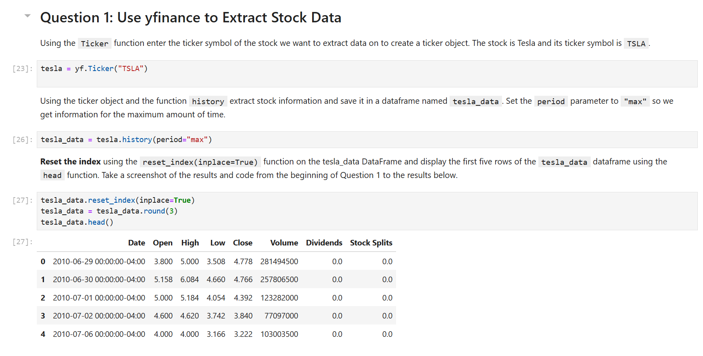
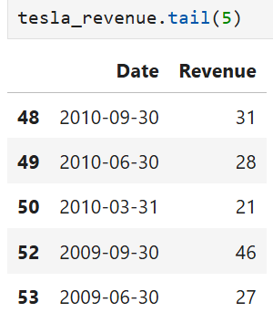
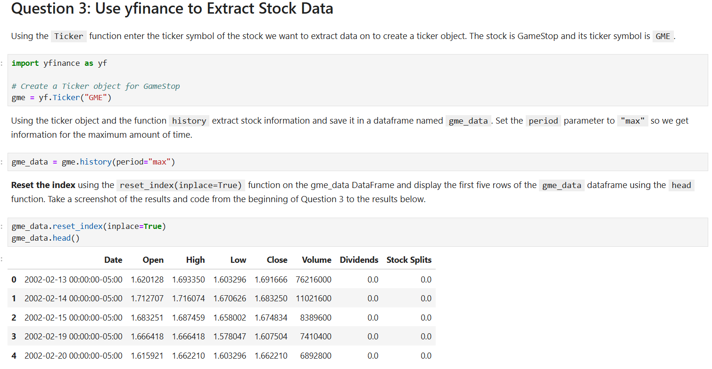
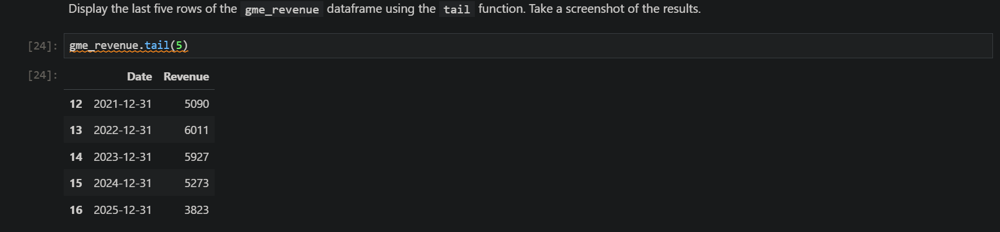
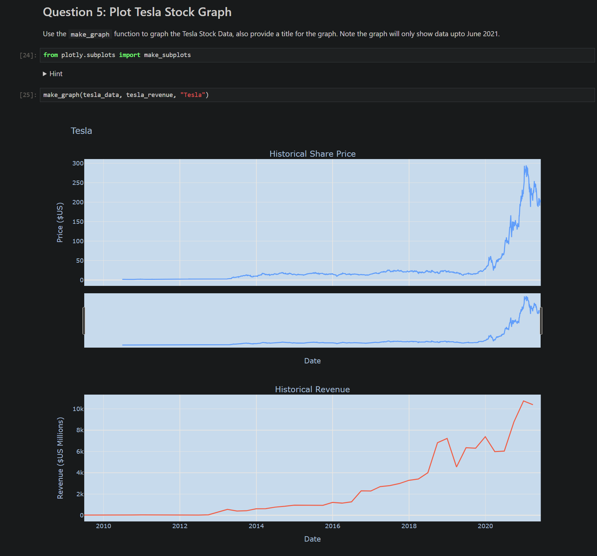
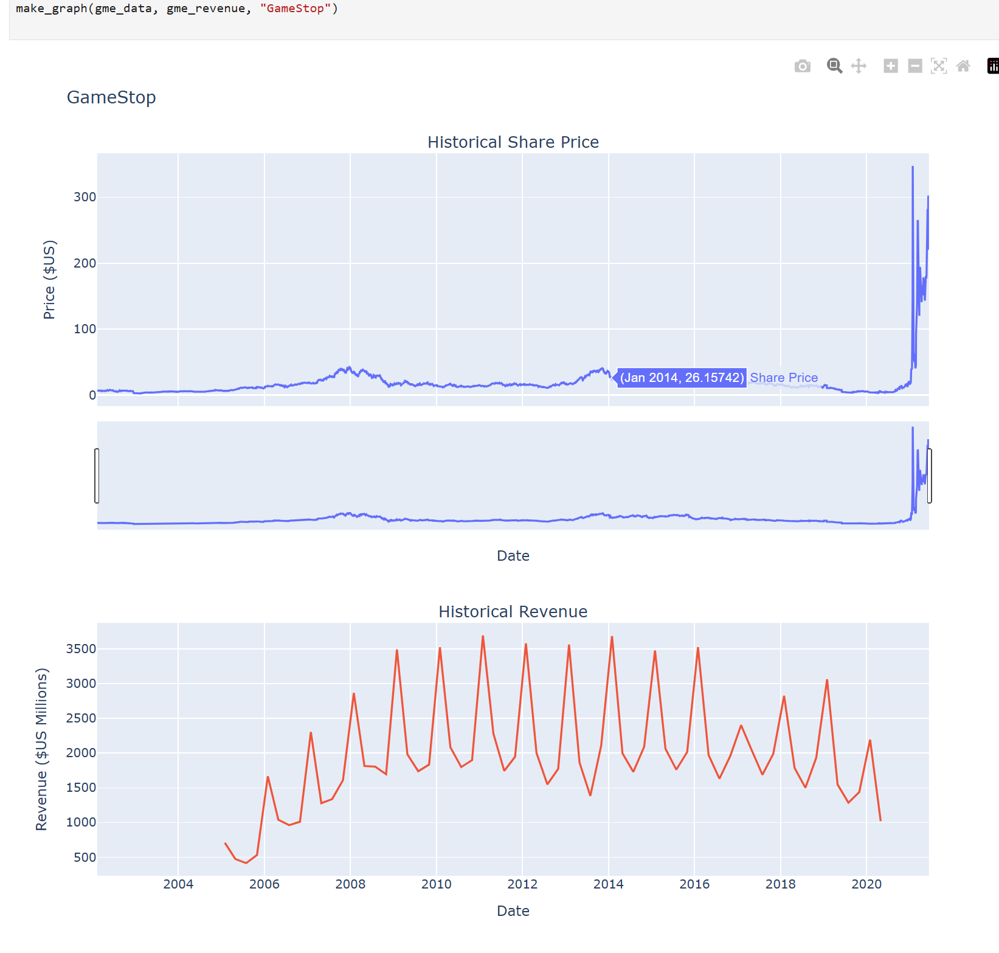

  
  &nbsp;&nbsp;
  <code style="font-size:9px;">import numpy as np</code> &nbsp;&nbsp; 
  <code style="font-size:9px;">from sklearn.linear_model import LinearRegression</code>
  &nbsp;&nbsp;🐍

# Coursera – IBM Python Project for Data Science  
### Stock Price & Revenue Analysis  

---

## 📘 Table of Contents

### Part 1 — Stock & Revenue Analysis (Q1–Q7)

- **1.1 Question 1 — Use yfinance to Extract Stock Data**  
- **1.2 Question 2 — Use Webscraping to Extract Tesla Revenue Data**  
- **1.3 Question 3 — Use yfinance to Extract Stock Data**  
- **1.4 Question 4 — Use Webscraping to Extract GME Revenue Data**  
- **1.5 Question 5 — Plot Tesla Stock Graph**  
- **1.6 Question 6 — Plot GameStop Stock Graph**  
- **1.7 Question 7 — Sharing your Assignment Notebook**  

🛠️ **Tools:** `yfinance`, `pandas`, `requests`, `BeautifulSoup`, `plotly`

---

## 📸 Coursera Submission Screenshots

These are the original screenshots submitted to Coursera for grading.

- **Question 1 — Use yfinance to Extract Stock Data**  
  

- **Question 2 — Webscraping Tesla Revenue Data**  
  

- **Question 3 — Use yfinance to Extract GameStop Stock Data**  
  

- **Question 4 — Webscraping GameStop Revenue Data**  
  

- **Question 5 — Plot Tesla Stock Graph**  
  

- **Question 6 — Plot GameStop Stock Graph**  
  

---

## ℹ️ Notes on Versions

- 🔹 **Coursera submission (this notebook):** all tasks Q1–Q7 completed and screenshots submitted.  
- 🔹 **IBM Cloud version:** notebook also uploaded to IBM Watson Studio.  
  📂 [View on IBM Cloud](https://dataplatform.cloud.ibm.com/analytics/notebooks/v2/68ab5a8f-a206-44ce-b99a-3138c9c58935/view?access_token=5f105c703536a0133190b848a2d42cce055e9a2ebbd8bb04a7521d6c536ee475&context=cpdaas)  
  ⚠️ *Due to the free Lite plan limits, editing is frozen for one month. This version shows all plots and tasks done, but small issues remain to be fixed when the environment unlocks.*  

- 🔹 **Extended version (GitHub):** in addition to the course tasks, a forecasting pipeline was added using **Prophet / ARIMA**, with exports to CSV, HTML, PNG, and ZIP.  
  📂 [Extended notebook on GitHub](https://github.com/VladBrilliant/Stock-Forecast-TSLA-GME/blob/main/notebooks/IBM_study/Python_Basics_for%20Data_Science_Project_1.ipynb)  
  🚧 *Work on the extended version is ongoing — new features, improved forecasting, and visualizations will be added over time.*  

📌 *This is the official project notebook submitted as part of the Coursera IBM Data Science Professional Certificate. The GitHub repo contains additional extended analysis and forecasting beyond the scope of the assignment.*
