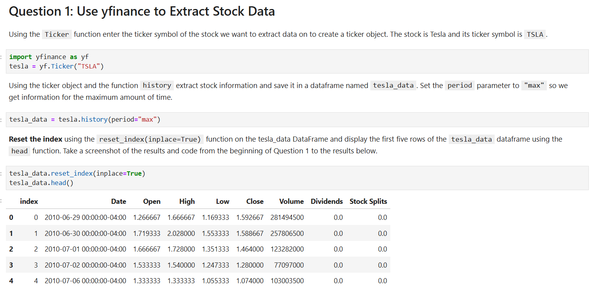
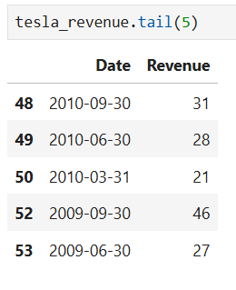
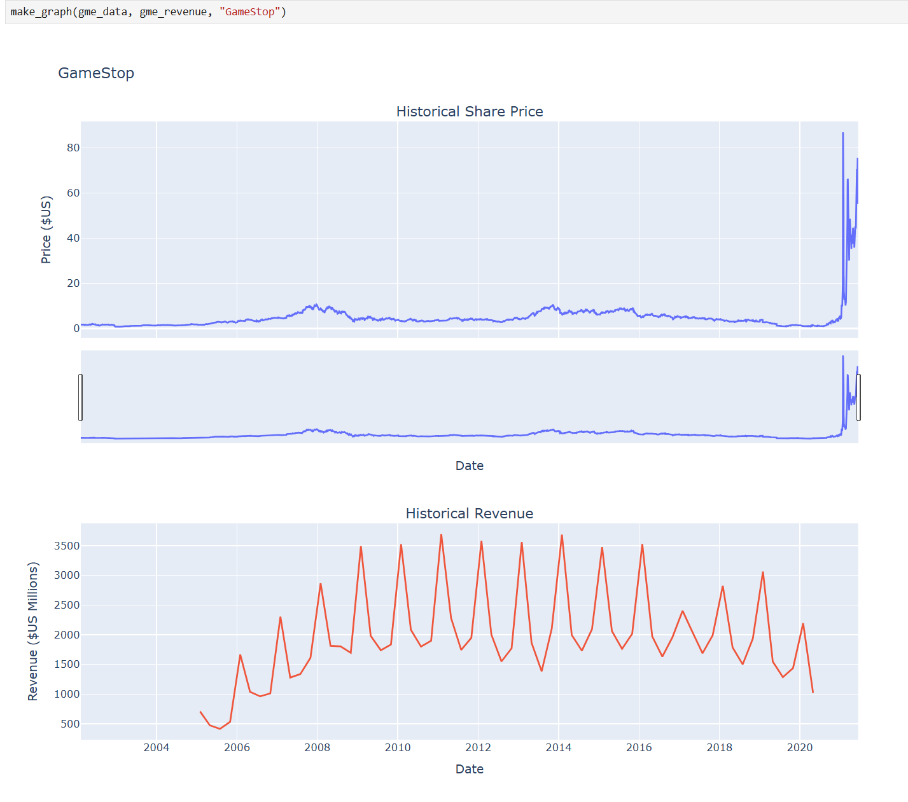

  
  &nbsp;&nbsp;
  
    <code>import numpy as np</code> · <code>from sklearn.linear_model import LinearRegression</code> · <code>model.fit(X, y)</code>
  
  &nbsp;&nbsp;🐍

<h1 align="center">Coursera – IBM Python Project for Data Science</h1>
<h3 align="center">Stock Price & Revenue Analysis (TSLA & GME)</h3>

---

## 📘 Table of Contents

- Define a Function that Makes a Graph  
- Question 1: Use yfinance to Extract Stock Data  
- Question 2: Use Webscraping to Extract Tesla Revenue Data  
- Question 3: Use yfinance to Extract Stock Data  
- Question 4: Use Webscraping to Extract GME Revenue Data  
- Question 5: Plot Tesla Stock Graph  
- Question 6: Plot GameStop Stock Graph  

---

## 📊 Screenshots (Submission Evidence)

| Q1 | Q2 | Q3 |
|----|----|----|
|  |  |  |

| Q4 | Q5 | Q6 |
|----|----|----|
|  |  |  |

---

## 📝 Notes on Versions

- 🔹 **IBM Cloud version:**  
  [View on IBM Cloud (notebook link)](https://dataplatform.cloud.ibm.com/analytics/notebooks/v2/68ab5a8f-a206-44ce-b99a-3138c9c58935/view?access_token=5f105c703536a0133190b848a2d42cce055e9a2ebbd8bb04a7521d6c536ee475&context=cpdaas)  
  ⚠️ Currently **unfinished** due to *Lite plan* restrictions (limited compute & notebooks). All tasks were executed and plots displayed, but saving/export features remain incomplete. Work will resume once quota resets.

- 🔹 **Extended version (GitHub):**  
  Adds **forecasting (Prophet / ARIMA)** and extended exports (CSV, HTML, PNG, ZIP).  
  📂 [Extended notebook](https://github.com/VladBrilliant/Stock-Forecast-TSLA-GME/blob/main/notebooks/Extended/Python_Project_for_Data_Science_Project_2.ipynb)  
  🚧 Work in progress — improving forecasts, adding Tableau dashboard, and polishing outputs.

  **Forecast Examples:**  

  | TSLA Forecast | GME Forecast |
  |---------------|--------------|
  |  |  |

---

## 🛠️ Tools

- `yfinance` — stock data extraction  
- `pandas` — data handling  
- `requests`, `BeautifulSoup` — web scraping  
- `plotly` — visualization  
